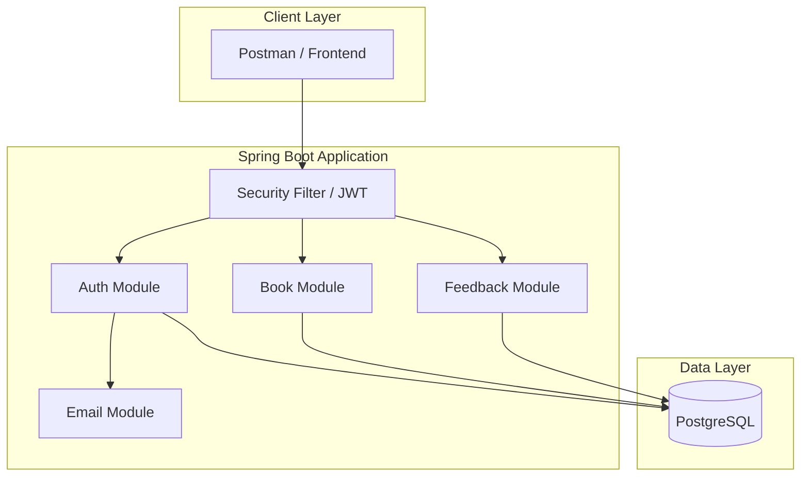
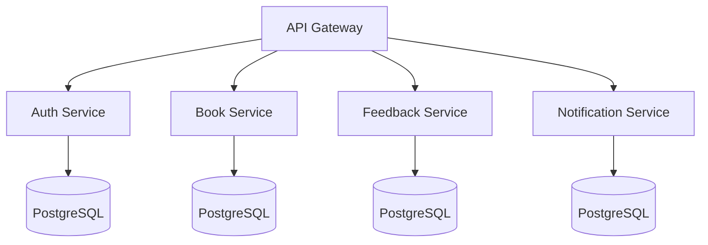
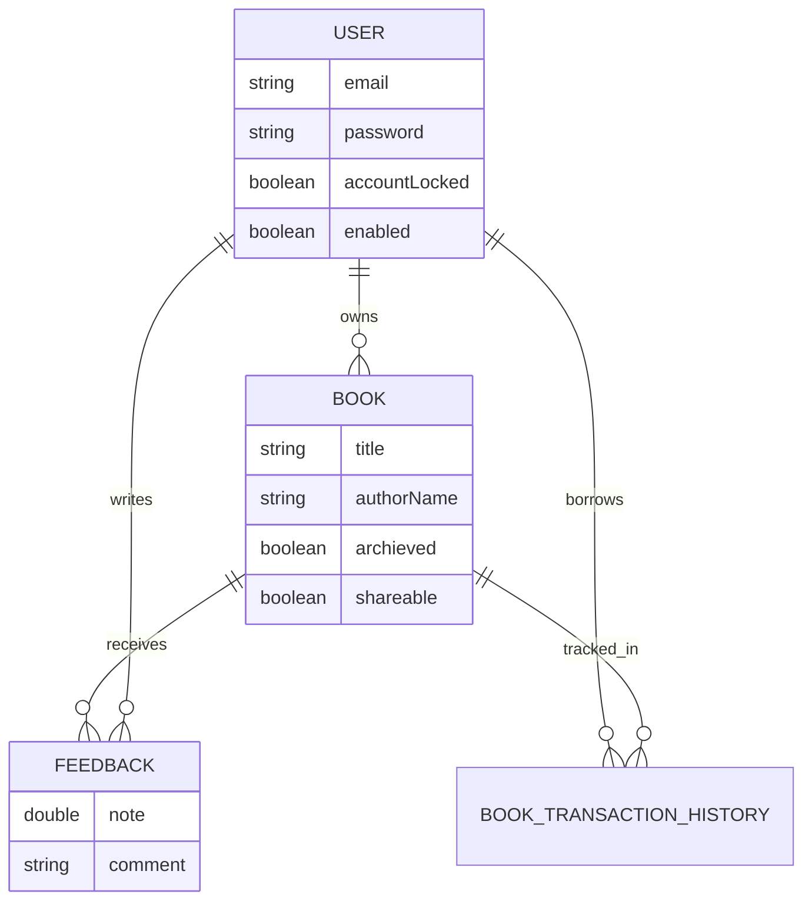

# 📚 Book Social Network – Backend API

A **production-grade Spring Boot backend** for a Book Social Network platform featuring **JWT authentication**, **email verification**, **book borrowing workflows**, **feedback system**, **Dockerized deployment**, and a **fully automated CI/CD pipeline using GitHub Actions**.

> ⚠️ **Important**: This project is designed to run via **CI/CD pipelines and Docker**, not via simple `mvn spring-boot:run`.

---

## 🎯 Why This Project?

This project was built to demonstrate how real-world backend systems are designed and deployed in production environments, including:

- **Secure Authentication**: Implementation of stateless security using JWT.
- **Email-based Activation**: Realistic user onboarding with token-based verification.
- **Clean Architecture**: Separation of concerns using a layered, maintainable structure.
- **Containerization**: Fully Dockerized environment for consistency across stages.
- **CI/CD Driven**: Automated delivery pipeline using GitHub Actions to reflect enterprise-grade practices.

It intentionally avoids hardcoded secrets and local shortcuts to reflect enterprise-grade practices.

---

## 🚀 Tech Stack (ATS Optimized)

**Backend**
* Java 17
* Spring Boot 3
* Spring Security (JWT)
* Spring Data JPA
* Hibernate
* Validation (Jakarta)
* Thymeleaf (Email Templates)

**Database**
* PostgreSQL (Production)
* H2 (Testing)

**DevOps & Infrastructure**
* Docker & Docker Compose
* GitHub Actions (CI/CD)
* Self-hosted GitHub Runner
* MailDev (Local Email Testing)

**Tools**
* Swagger / OpenAPI
* Maven
* Postman

---

## ✨ Core Features

* 🔐 JWT-based Authentication & Authorization
* 📧 Email Account Activation (Token-based)
* 📚 Book Management (CRUD, Shareable, Archive)
* 🔄 Book Borrow & Return Workflow
* ⭐ Feedback & Rating System
* 📄 Pagination & Filtering
* 🧾 Global Exception Handling
* 🐳 Fully Dockerized Setup
* ⚙️ Automated CI/CD Pipeline

---

## 🧱 Clean Architecture Overview

This project follows **Clean Architecture + Layered Architecture** principles.


```

Controller → Service → Repository → Database
↓
Mapper / DTO

```

### 📦 Package Structure


```

com.prashanth.book
├── auth          # Authentication & JWT logic
├── book          # Book domain (entity, service, repo)
├── feedback      # Feedback & ratings
├── history       # Book transaction history
├── user          # User & roles
├── security      # JWT filter & security config
├── email         # Email service & templates
├── file          # File storage utilities
├── common        # BaseEntity, PageResponse
├── handler       # Global exception handling
└── config        # Beans, OpenAPI, auditing

```

---

## 🏗️ Architecture Diagrams

### 1️⃣ Monolithic Architecture (Current)



**Why Monolith?**

* Faster development
* Easier debugging
* Ideal for early-stage systems
* Clean separation allows future migration

---

### 2️⃣ Microservices (Future Scope)



> The current design intentionally supports **easy migration to microservices**.

---

## 🗃️ ER Diagram (High-Level)



**Key Relationships**

* User ↔ Book (Owner)
* User ↔ BookTransactionHistory (Borrower)
* Book ↔ Feedback (Ratings & Reviews)

---

## 📘 API Documentation (Swagger)

Once deployed, Swagger UI is available at:
`http://<HOST>:8088/swagger-ui/index.html`

---

## 🔄 CI/CD Pipeline (GitHub Actions)

1. **Compile**
2. **Unit Tests**
3. **Build JAR**
4. **Build & Push Docker Image**
5. **Deploy via Docker Compose (Self-hosted Runner)**

---

## 🐳 Docker & Deployment

### ⚠️ Local Execution Disclaimer (Important)

❌ This project **cannot run fully locally out-of-the-box** because environment variables are injected via **GitHub Secrets** and Docker images are pulled dynamically. This is **intentional** to reflect production best practices.

---

## 📌 Project Status

**Status:** ✅ Stable & Functional

---

## 👨‍💻 Author

**Prashanth P** Java Backend Developer

📧 Email: `prashanthpremchand@gmail.com`

```
